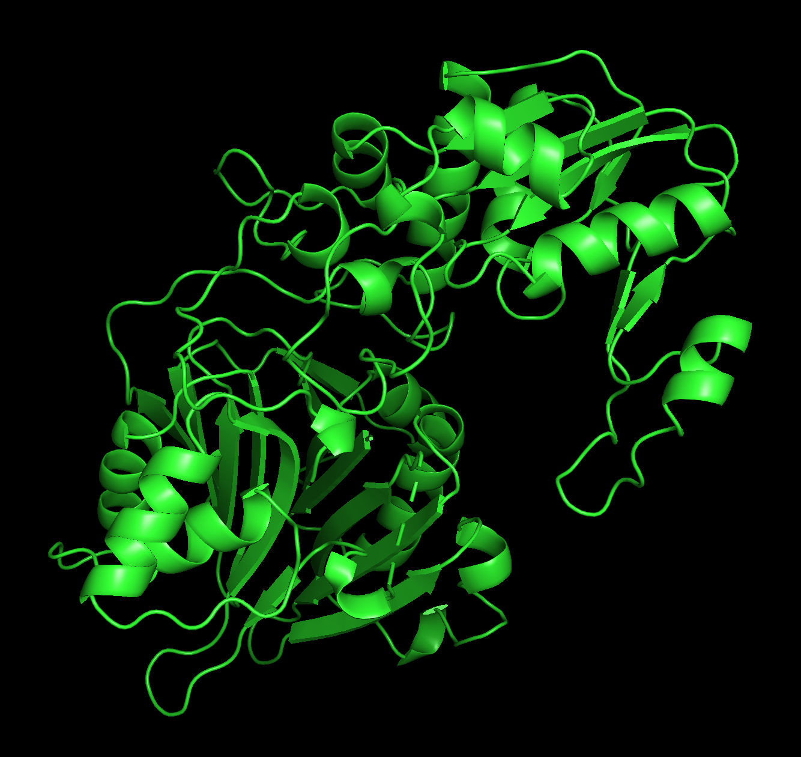
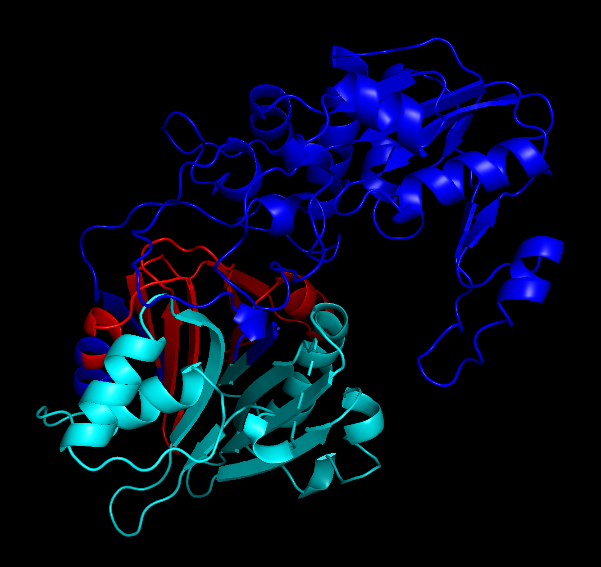

# Python command line application to visualize protein domains

## Dependencies

Python >= 3.9

## Installation

```bash
bash install.sh
```

## Usage

```bash
colordomains -h
usage: colordomains [-h] [-i INPUT] [-o OUTPUT] [-d DOMAINS [DOMAINS ...]]

Python command line application to visualize protein domains

optional arguments:
  -h, --help            show this help message and exit
  -i INPUT, --input INPUT
                        3D protein structure in PDB format
  -o OUTPUT, --output OUTPUT
                        Modified copy of the input 3D protein structure
  -d DOMAINS [DOMAINS ...], --domains DOMAINS [DOMAINS ...]
                        Protein domain start and end residue numbers (whitespace separated)
```

## Visualization

```bash
colordomains -i 1ao0A.pdb -o 1ao0A_color.pdb -d 5 142 150 216
```

The modified copy of the input 3D protein structure can be viewed on a visualization software by selecting b-factors.

      
